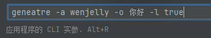

# Code-Generator-Basic

## 项目介绍
项目的第一阶段，制作一个**代码生成器**，通过这个生成器来生成一段代码

这是一段示例代码
```agsl
/*
 * @time 2024/3/3 9:15
 * @package com.wenjelly
 * @project Default (Template) Project
 * @author WenJelly
 */
import java.util.Scanner;

public class MainTemplate {
    public static void main(String[] args) {
        Scanner scanner = new Scanner(System.in);
        while (scanner.hasNext()) {
            // 读取输入元素个数
            int n = scanner.nextInt();
            // 读取数组
            int[] arr = new int[n];
            for (int i = 0; i < n; i++) {
                arr[i] = scanner.nextInt();
            }
            // 处理问题逻辑，根据需要进行输出
            // 示例：计算数组元素的和
            int sum = 0;
            for (int num : arr) {
                sum += num;
            }
            System.out.println("Sum: " + sum);
        }
        scanner.close();
    }
}
```
通过给生成器输入一些参数，使得生成器生成我们所需的目标代码，例如：
1. 去掉While循环
2. 将作者WenJelly修改成xxx、 
3. 将输出语句" Sum= " 修改成 " 数组元素的和为： "

生成后的代码为：
```agsl
/*
 * @time 2024/3/3 9:15
 * @package com.wenjelly
 * @project Default (Template) Project
 * @author xxx
 */
import java.util.Scanner;

public class MainTemplate {
    public static void main(String[] args) {
        Scanner scanner = new Scanner(System.in);
        // 读取输入元素个数
        int n = scanner.nextInt();
        // 读取数组
        int[] arr = new int[n];
        for (int i = 0; i < n; i++) {
            arr[i] = scanner.nextInt();
        }
        // 处理问题逻辑，根据需要进行输出
        // 示例：计算数组元素的和
        int sum = 0;
        for (int num : arr) {
            sum += num;
        }
        System.out.println("数组元素的和为： " + sum);
        scanner.close();
    }
}
```
参数可以由用户自己输入

## 技术选型
- Picocli 命令行开发
- FreeMarker 模板引擎
- 命令设计模式
- Hutool工具库

## 快速体验

1. 在``resources``目录下存放了Acm基础算法代码，以及Acm的模板ftl文件，找到``DynamicGenerator``类，查看里面的路径是否正确
2. 找到``Main``类，在右上角运行键找到编辑按钮

   

   在程序实参那输入想要传输的参数，参数列表可以查看``cli``目录，或输入--help后运行``Main``即可查看

   

   

   想要查看文件列表将--help改成list即可

   

   查看配置也是同理

3. 生成目标代码，将程序实参改为 generate -a ${你自己想要输入的参数} -o ${你自己想要输入的参数} -l [true/false];

   

   运行即可生成目标代码了

4. generate对应``GenerateCommand``类，里面有三个参数，-a（--author） 作者，-o（--output）输出语句参数，-l（--loop）是否开启循环
5. list对应``ListCommand``类，用于遍历项目文件列表
6. config对应``ConfigCommand``类，用于查看配置
>ps:也可以直接通过在``Main``类中设置args参数来进行传参

找到``Main``类，给args直接输入参数，再运行代码即可，无需在配置中设置程序实参了
```agsl
public class Main {
    public static void main(String[] args) {
        CommandExecutor commandExecutor = new CommandExecutor();
        args = new String[] {"generate","-a","wenjelly","-o","你好","-l","false"};
        commandExecutor.doExecute(args);
    }
}
```
生成后的结果如下：


如果想要生成一段自己的代码，可以将目标代码存放在``resources/template``目录下，同时自己编写一段ftl模板文件，然后在去修改``DynamicGenerator``和``StaticGenerator``类里面的文件路径即可

## 实现思路
对于静态文件的生成，可以直接采用文件复制的方法，例如Hutool工具类的FileUtil.copy方法
```agsl
FileUtil.copy(srcPath, destPath, isOverride);
```
亦或是使用递归的方式
```agsl
// 区分是文件还是目录
if (inputFile.isDirectory()) {
    File destOutputFile = new File(outputFile, inputFile.getName());
    // 如果是目录，首先创建目标目录
    if (!destOutputFile.exists()) {
        destOutputFile.mkdirs();
    }
    // 获取目录下的所有文件和子目录
    File[] files = inputFile.listFiles();
    // 无子文件，直接结束
    if (ArrayUtil.isEmpty(files)) {
        return;
    }
    for (File file : files) {
        // 递归拷贝下一层文件
        copyFileByRecursive(file, destOutputFile);
    }
} else {
    // 是文件，直接复制到目标目录下
    Path destPath = outputFile.toPath().resolve(inputFile.getName());
    Files.copy(inputFile.toPath(), destPath, StandardCopyOption.REPLACE_EXISTING);
}
```

而对于动态文件的生成，也就是根据用户输入的参数来生成对于的文件，采用的是FreeMarker 模板引擎技术
>FreeMarker 模板引擎的语法可以参考：https://freemarker.apache.org/docs/index.html 官方文档

用户输入的参数采用 Picocli命令行 来进行获取
>Picocli 开发教程可以参考：https://github.com/remkop/picocli

### 学习指南

动态文件的生成由 模板 + 数据模型 来实现，数据模型建议使用单独一个类来定义，参考``MainTemplateConfig``类。参数通过用户在命令输入的参数获取，然后封装到对应的数据模型类里面。

在使用Picocli命令行开发时，建议通过引导的方式来让用户输入参数。

源文件与模板文件存放在``resources/templates``目录下，模板文件以``.ftl``结尾

数据模型类代码参考：``MainTemplateConfig``类

动态文件的生成代码参考：``DynamicGenerator``类

静态文件的生成代码参考：``StaticGenerator``类

Picocli命令行开发代码参考： ``cli``目录

> 作者：WenJelly
> 
> 日期：2024-4-21 17：27
> 
> 版本：Code-Generator-Basic 1.0


