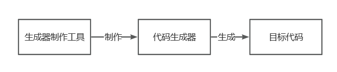
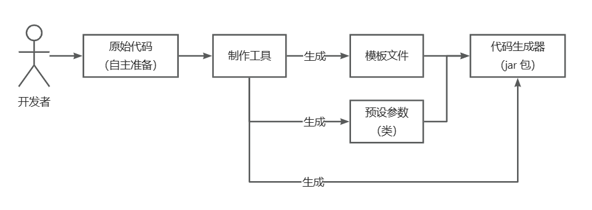
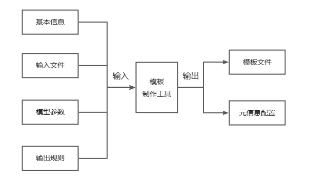

# Generator-Maker-Plus
这个模块用于制作代码生成器的工具，用户传入一个文件，然后按要求填写对应的信息，然后即可制作出一款定制化的代码生成器，通过这款代码生成器即可生成用户传入的目标代码。
该项目共三个模块，本模块为第二阶段结束，目前可以通过用户准备需要生成的代码，定制化生成一个该代码的生成器，用户也可以指定哪些文件不需要生成，哪些文件内容需要替换等：比如说包名替换，将所有与包名相关的字符都替换成制作者想要的包名字符。

**本模块相当于生成器制作工具阶段**

用户准备了一个Spring-Boot项目，通过这个模块的执行，可以生成一个Spring-Boot项目的代码生成器，这个代码生成器可以按照用户的意愿去生成自己想要的Spring-Boot项目模板，然后通过模板即可生成用户想要的Spring-Boot项目了

比如说：用户手头现在有一个Spring-Boot项目，但是他想将这个项目的包名、作者、数据库等信息全部替换成自己的信息，即可以使用这个模块去生成自己想要的项目了，该模块会按照用户给出的信息，将用户所需要替换的地方、修改的地方进行修改、替换

# 技术实现
- Picocli 命令行开发
- FreeMarker 模板引擎
- 双检锁单例模式
- 模板方法模式
- 命令模式
- Java集合类、文件IO、Process
- Hutool工具库

# 实现流程


本模块是中心部分的**模块制作工具**
通过用户的输入的基本信息、输入文件、模型参数、输出规则来生成元信息配置。以及源代码的模板文件，通过``MainGenerator``/``DisMainGenerator``/``MainGeneratorTemplate``执行类去生成一个代码生成器，最后代码生成器通过源代码的模板文件即可生成用户最终的目标代码

1. 基本信息：包名、版本号、名称、描述、作者等信息。
2. 输入文件：要“挖坑”的原始文件。可能是一个文件、也可能是多个文件。
3. 模型参数：要引导用户输入并填充到模板的模型参数，对应元信息的 modelConfig 模型配置。
4. 输出规则：作为一个后续扩展功能的可选参数，比如多次制作时是否覆盖旧的配置等。
5. 模板文件：源代码的模板文件，通过FreeMarker 模板引擎制作，生成器通过模板去制作想要的代码
6. 元信息配置：制作生成器的信息，比如哪些需要替换、输入、输出位置等


# 快速上手
## 1、准备目标代码的基础信息
由于这是第二阶段，并非最终阶段，所以没有编写用户输入的模块，这里需要手动准备一个json格式的文件信息
内容以``template``包下的``TemplateMakerConfig``类为模板
例如：
```agsl
{
  "id": 1,
  "newMeta": {
    "name": "spring-boot-generator",
    "description": "spring-boot生成器",
    "basePackage": "com.wenjelly",
    "version": "1.0",
    "author": "WenJelly",
    "createTime": "2024-3-21",
    "fileConfig": {
    },
    "modelConfig": {
    }
  },
  "templateMakerModelConfig": {
  },
  "templateMakerFileConfig": {
  },
  "originProjectPath": "D:\\Development\\IDEAJavaProjects\\wenjelly-generators\\wenjelly-generator-code-repositories\\springboot-init"
}
```
其他具体信息可自行补充
## 2、读取配置文件并执行
在``TemplateMaker``类下将你的Json配置文件读取并转换为Bean对象，然后将该对象传入makeTemplate方法并执行即可
```agsl
// 第读取配置文件
String springBootMeta = ResourceUtil.readUtf8Str("${JsonPath}");
// 将配置文件转换成对象
TemplateMakerConfig templateMakerConfig = JSONUtil.toBean(springBootMeta, TemplateMakerConfig.class);
// 制作模板与生成配置文件，下同
makeTemplate(templateMakerConfig);
```
执行完成后会生成``.temp``工作空间，在该空间里面已经将源代码制作成了模板，接下来还差一个生成器
## 3、制作生成器
在执行完第二部之后，会在``.temp\${Id}\${ProjectName}``生成一个meta.json文件，这是你源代码的配置元信息，然后在根目录的``src/main/java/com/wenjelly/makerplus/meta``的``MetaManager``类中的``initMeta``方将路径改为刚刚的meta.json路径
最后找到``main``包下的``DisMainGenerator``类，执行方法即可，该类继承了``MainGeneratorTemplate``类，``MainGeneratorTemplate``类是一个模板，里面有制作生成器的所有流程

制作生成器的模板在``resource/templates``包下。``MainGeneratorTemplate``则是根据这里面的内容来制作生成器。
## 4、执行指令生成目标代码
正常来说，生成器制作完后能够自动的对项目进行打jar包以及封装称脚本，所有我们只需要进到生成好的``generator``包下的项目里面，然后以终端方式打开，执行脚本./generator --help即可
其余指令可根据--help进行查看
> 作者：WenJelly
> 
>日期：2024-3-23 17:51


