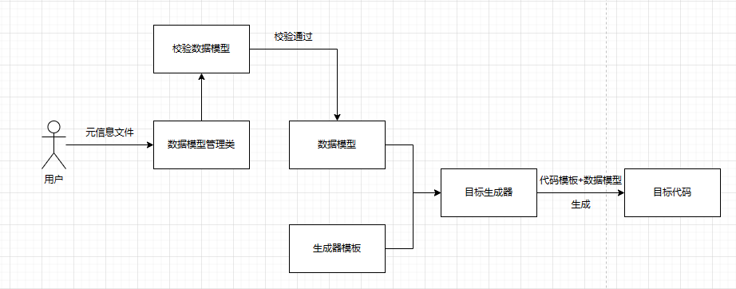

# Code-Generator-Maker
## 模块介绍

用于通过生成器模板来制作生成器。属于第二阶段早期测试
在Basic模块中已经开发出了基础代码生成器，现在要对其进行通用模板化，得到基础生成器的.ftl模板文件
将生成器模板文件与我们手动编写的数据模型文件结合得到新的生成器。
最后测试使用新的生成器能否生成代码。

## 技术选型
- Picocli 命令行开发
- FreeMarker 模板引擎
- 命令设计模式
- 双检索单例模式
- 模板方法模式
- Hutool工具库

## 快速体验
1. 准备数据模型，内容可参考``resources/meta.json``
2. 修改``MetaManager``类的数据模型的文件位置，该数据模型是生成器模板代码所需要的数据模型
3. 执行``Main``类即可得到代码生成器，生成好的代码会存放在``generator``目录下
4. 在生成出来的代码生成器目录下，右键打开终端，执行脚本指令即可生成代码

指令格式如下
```shell
./generator --help #查看帮助手册
./generator list # 查看文件列表
./generator config # 查看指令配置
./generator generate -a ${作者名字} -o ${输出文本信息} -l ${是否开启循环}
```
其中关于生成指令``generate``后面的参数是根据数据模型文件来决定的。

在``resources``目录下有Acm代码生成的数据模型

## 实现思路

1. 基于Basic模块编写代码生成器通用模板文件 
2. 准备生成器模板文件所需的数据模型 
3. 模板文件与数据模型结合得到目标生成器代码 
4. 对目标生成器代码进行构建jar包、封装脚本，方便用户通过终端指令运行 
5. 执行脚本，通过生成器得到目标代码

## 学习指南
``cli``目录：使用Picocli命令行开发，用于接收用户在终端输入的参数，然后将参数赋值给Meta对象，得到数据模型。

- ConfigCommand：配置命令，用户输入 ./脚本名称 config 即可查看配置信息，目前实现的是查看 脚本支持哪些字段以及字段的类型
- GenerateCommand：主要用于接收用户输入的参数，提示用户生成器所需的数据模型有哪些，然后接收用户输入的参数
- ListCommand：查看文件列表，与Linux的 -l 命令相似
- TestArgGroupCommand：GenerateCommand的升级版，可以实现嵌套指令，比如指令A询问是否开启MySql，如果用户输入True，即可继续让用户输入关于MySql的信息，如果用户输入False，则不会再提示用户输入MySql信息
- CommandExecutor：用于执行指令后的行为，例如将参数封装到Meta对象里面，得到数据模型

``generator``目录：用于制作目标代码

- DynamicFileGenerator：执行动态模板的生成，对模板上需要修改的值按照数据模型的参数进行填充
- StaticFileGenerator：执行静态文件的生成，原理是直接对文件进行复制
- FileGenerator：调用动态+静态的方法，生成全部目标代码
- JarGenerator：将生成器打包成jar包
- ScriptGenerator：使用程序来封装脚本，让用户直接通过脚本运行程序

``main``目录：用于制作生成器目标代码

- MainGeneratorTemplate：通过生成器模板代码制作生成器目标代码，生成器模板代码全部存放在``resource``资源目录下，本类使用了模板设计模式，将每一步骤进行了提取，方便子类重写对应的方法
- DistMainGenerator：用于生成简易版生成器目标代码文件，继承``MainGeneratorTemplate``类，可以通过重写``doDistDir``方法来实现生成效果

``meta``目录：用于存放数据模型的各种方法
- ``enums``目录：存放需要使用到的枚举类，规范开发方式
- Meta：数据模型，与meta.json一一对应，通过Meta数据模型生成生成器目标代码
- MetaException：异常类，用于提示生成过程中的异常
- MetaManager：数据模型管理，采用了双检锁单例设计模式来对Meta进行生成，减少内存消耗
- MetaValidator：对Meta数据模型进行检验，如：不为空判断，赋初值等。

``model``目录：存放生成目标代码的数据模型
- DataModel：目标代码生成所需的数据模型

``resiources``目录：资源目录
- ``templates``目录：存放生成器模板代码，通过上面的目录来制作生成器模板代码
- meta.json：生成器模板代码所需要的元信息，也就是数据模型

> 作者:WenJelly
> 
> 日期：2024-4-23 10：35
> 
> 版本：Code-Generator-Maker 1.1


